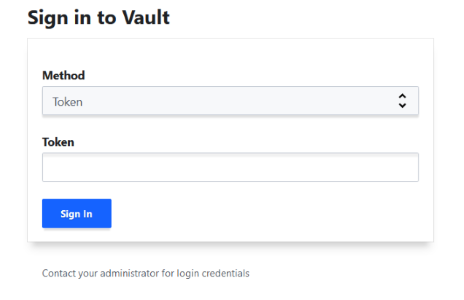

- this project shows how to integrate vault with terraform to secure your secrets.

- What is Vault?
    -Vault comes with various pluggable components called secrets engines and authentication methods allowing you to integrate with external systems. The purpose of those components is to manage and protect your secrets in dynamic infrastructure (e.g. database credentials, passwords, API keys).

Requirements:
    - vault installed.

in your terminal type: 
    - vault server -dev

    - open- http://127.0.0.1:8200 in your browser.

    - copy and paste the token.

    - navigate to secrets and create secret.

back to terraform:
    - create a new file vault.tf

    - in the providers.tf :
    

-- congratulations !! now our secrets are secure using hashicorp vault. 

